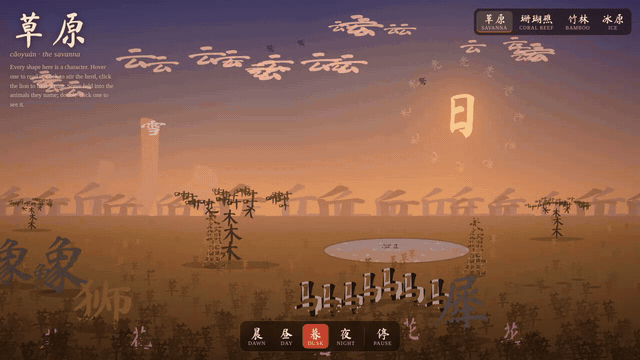

# Hanzi Worlds 字的世界

**Four living landscapes drawn entirely in Chinese characters.** Every animal, plant, rock and ray of light is the character for itself. Hover anything to read it. Some characters fold into the creature they name, then unfold back.

### [→ Open it](https://masonprr.github.io/hanzi-worlds/)

## The worlds

| | |
|---|---|
| **草原 Savanna** | 象 elephants spray water, 长颈鹿 (literally "long-neck deer") is stacked top to bottom into a giraffe, the 狮 lion stalks the 羚 gazelles, and 花 flowers bloom out of their own strokes. |
| **珊瑚礁 Coral reef** | Schools of 鲹 jacks, 鲭 mackerel and 鲷 sea bream swerve from the 鲨 shark, the 鲀 pufferfish inflates, and the 章鱼 octopus inks and jets away. |
| **竹林 Bamboo forest** | Stalks of stacked 竹 with leaves painted as 个 and 介, the way ink painters do it. A 熊猫 panda eats, the 鹤 crane fishes, a 蛙 frog snaps up a 蝇 fly. |
| **冰原 Ice world** | 企鹅 penguins (企, a person on tiptoe) slide off to fish, one lays a 蛋 egg that hatches a 雏 chick, and the 极光 aurora bends toward your cursor at night. |

Every card explains the character: its pinyin, its meaning and where its shape comes from.

## Things to try

- **Hover** any character to read it. Hold still and the card stays.
- **Click** animals: the lion roars, the octopus inks, the penguins slide, the panda rolls.
- **Double-click** 象, 花, 鱼, 龟, 熊, 鹤 or 企 to watch it fold into the animal.
- **Switch the time of day** at the bottom. Night brings fireflies, glowing jellyfish and the aurora.
- Link straight to a world with `#reef`, `#bamboo` or `#ice`.

## How the folding works

Each foldable character is stored as its real stroke centerlines, in writing order. Every stroke is matched to the nearest part of a hand-drawn line picture of the animal (a trunk, an ear, a flipper), then each stroke bends along an arc into its part, staggered in stroke order. Once folded, parts like wings and tails move on their own pivots.

Everything is one HTML file with plain Canvas 2D: no build step and no libraries.

## Credits

- Stroke data: [Make Me A Hanzi](https://github.com/skishore/makemeahanzi), under the Arphic Public License (see `LICENSE-ARPHIC.txt`).
- Fonts: Ma Shan Zheng and Noto Serif, via Google Fonts (SIL Open Font License).
- Built with Claude.

## License

Code: MIT (see `LICENSE`). The stroke data inside the `MORPH` block of `index.html` stays under the Arphic Public License.
